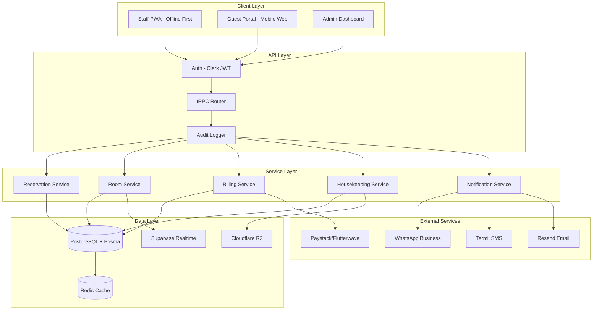

# Houzzhills HMS — Property Management System
### Kaduna's Premier Apartment Hotel Management Platform

---

## Quick Start

```bash
npm install
npm run dev
# Open http://localhost:3000
# Login: any demo email + password: demo1234
```

## Direct booking

The public booking page is available at `/book`. It calls Houzzhills HMS through
server-side proxy routes, so the HMS API key is never exposed to the browser. Configure
`HOUZZHILLS_HMS_URL` and `HOUZZHILLS_PUBLIC_API_KEY` in `.env.local`; the key must match
the HMS value. The website creates a temporary reservation and redirects the guest to
the HMS-owned Paystack checkout.

---

## Deliverable 1 — System Architecture

```
┌─────────────────────────────────────────────────────────────────┐
│                        CLIENT LAYER                             │
│  Staff PWA (offline-first)  │  Guest Portal  │  Admin Dashboard │
│  Next.js 15 App Router + Tailwind v4 + Framer Motion           │
└──────────────────────────┬──────────────────────────────────────┘
                           │ HTTPS / WSS
┌──────────────────────────▼──────────────────────────────────────┐
│              API LAYER (Next.js API Routes + tRPC)              │
│  JWT Auth (Clerk)  │  Rate Limit (Upstash)  │  Audit Middleware │
└──────────────────────────┬──────────────────────────────────────┘
                           │
┌──────────────────────────▼──────────────────────────────────────┐
│                     SERVICE LAYER                               │
│  Reservations │ Rooms │ Guests │ Billing │ Housekeeping         │
│  Inventory    │ Staff │ Notify │ Reports │ Night Audit          │
└──────┬────────────────────────────────────────┬─────────────────┘
       │                                        │
┌──────▼──────────┐  ┌──────────────┐  ┌───────▼──────────────┐
│  PostgreSQL     │  │  Redis       │  │  Supabase Realtime   │
│  (Neon/Supabase)│  │  (cache +    │  │  (room board, chat,  │
│  + Prisma ORM   │  │   job queue) │  │   notifications)     │
└─────────────────┘  └──────────────┘  └──────────────────────┘
       │
┌──────▼──────────────────────────────────────────────────────────┐
│                    EXTERNAL INTEGRATIONS                        │
│  Paystack │ Flutterwave │ Termii SMS │ WhatsApp Business API    │
│  Cloudflare R2 (files) │ Resend (email) │ QuickBooks API        │
└─────────────────────────────────────────────────────────────────┘
```

### Mermaid Diagram



---

## Deliverable 2 — Database Schema

See `prisma/schema.prisma` for the complete schema. Key tables:

| Table | Purpose | Key Indexes |
|-------|---------|-------------|
| `properties` | Multi-property config | `code` unique |
| `rooms` | 12 rooms with rates & status | `(propertyId, status)` |
| `guests` | Guest profiles + loyalty | `phone`, `email`, `idNumber` |
| `reservations` | All bookings | `(checkIn, checkOut)`, `status`, `confirmationNumber` |
| `folio_items` | Line-item charges | `reservationId` |
| `payments` | Payment records | `reservationId` |
| `housekeeping_tasks` | Cleaning assignments | `(roomId, status)`, `(assignedTo, status)` |
| `maintenance_tickets` | Repair tickets | `(status, priority)` |
| `inventory_items` | Stock management | `(category, location)` |
| `inventory_movements` | Stock in/out log | `itemId` |
| `staff` | All staff + auth | `(propertyId, role)` |
| `audit_logs` | NDPR compliance trail | `(entity, entityId)`, `createdAt` |
| `night_audits` | Daily audit records | `auditDate` unique |

---

## Deliverable 3 — User Flow Diagrams

### Check-In Flow
```
Guest Arrives
    │
    ▼
Search Reservation (name / confirmation # / phone)
    │
    ├─ Found ──► Verify ID (scan/manual) ──► Digital Reg Card + E-Signature
    │                                              │
    │                                              ▼
    │                                    Collect Payment (if balance)
    │                                              │
    │                                              ▼
    │                                    Assign Room ──► Generate Key Code
    │                                              │
    │                                              ▼
    │                                    Update Room → OCCUPIED
    │                                              │
    │                                              ▼
    │                                    Send WhatsApp Welcome + WiFi Code
    │
    └─ Not Found ──► Walk-in Form ──► (same flow above)
```

### Housekeeping Flow
```
Room Checkout Detected (auto-trigger)
    │
    ▼
Create HK Task (priority: HIGH, type: checkout_clean)
    │
    ▼
Supervisor Assigns to Housekeeper (mobile app)
    │
    ▼
Housekeeper: Start Task ──► Upload Before Photos
    │
    ▼
Complete Checklist (12 items)
    │
    ▼
Upload After Photos ──► Mark Complete
    │
    ▼
Supervisor Inspection Task (auto-created)
    │
    ├─ Pass ──► Room Status → INSPECTED → AVAILABLE
    └─ Fail ──► Re-assign for re-clean + note
```

### Night Audit Flow
```
11:00 PM — Night Auditor Logs In
    │
    ▼
System Pre-Check:
  • All in-house folios balanced?
  • Any no-shows to process?
  • Pending payments?
    │
    ▼
Post Nightly Room Charges (auto for all occupied rooms)
    │
    ▼
Process No-Shows (cancel + release rooms)
    │
    ▼
Reconcile Payments (cash drawer, POS, transfers)
    │
    ▼
Generate Night Audit Report (PDF)
    │
    ▼
Roll Date ──► Email Report to Owner + Accountant
    │
    ▼
Archive & Lock Day's Transactions
```

---

## Deliverable 4 — Feature Prioritization

### MVP (Weeks 1–8)
- [x] Room status board (7 statuses)
- [x] Reservations CRUD (create, check-in, check-out)
- [x] Guest profiles
- [x] Folio management + basic billing
- [x] Cash/POS/bank transfer payments
- [x] Housekeeping task board
- [x] Maintenance tickets
- [x] Dashboard KPIs (occupancy, ADR, RevPAR)
- [x] Staff RBAC (8 roles)
- [x] Dark/light mode
- [x] Mobile-responsive layout

### Phase 2 (Weeks 9–16)
- [ ] Paystack + Flutterwave integration
- [ ] WhatsApp Business API (confirmations, reminders)
- [ ] Termii SMS gateway
- [ ] PDF invoice generation
- [ ] Night audit workflow
- [ ] Inventory management + low-stock alerts
- [ ] Guest portal (mobile web)
- [ ] Digital check-in + e-signature
- [ ] Offline sync (IndexedDB + service worker)
- [ ] Push notifications

### Phase 3 (Weeks 17–24)
- [ ] Booking.com / Airbnb channel manager
- [ ] Dynamic pricing engine (AI-assisted)
- [ ] QuickBooks / Xero integration
- [ ] Biometric staff attendance
- [ ] OCR for ID scanning
- [ ] Smart lock integration (TTLock / Yale)
- [ ] Guest loyalty program
- [ ] Multi-property support
- [ ] Advanced analytics + forecasting
- [ ] Scheduled email reports

---

## Deliverable 5 — UI/UX Design System

### Color Palette
```
Brand Gold:    #c8861a (primary actions, accents)
Background:    #fafaf9 (light) / #0c0a09 (dark)
Surface:       #ffffff / #1c1917
Border:        #e7e5e4 / #292524
Text Primary:  #1c1917 / #fafaf9
Text Muted:    #78716c / #a8a29e

Status Colors:
  Available:   #22c55e (green)
  Occupied:    #3b82f6 (blue)
  Dirty:       #f97316 (orange)
  Clean:       #10b981 (teal)
  Inspected:   #8b5cf6 (violet)
  Maintenance: #ef4444 (red)
  Out of Order:#6b7280 (gray)
```

### Typography
- Font: Geist Sans (system fallback: Inter, system-ui)
- Scale: 10px (labels) → 12px (captions) → 14px (body) → 16px (subheadings) → 20px (headings) → 24px (KPIs)
- Weight: 400 (body), 500 (medium), 600 (semibold), 700 (bold)

### Component Library (zero external deps)
- `Badge` — status pills with color/bg props
- `StatusDot` — animated pulse dot for live status
- `Card` — surface container with optional hover
- `Button` — 5 variants (primary, secondary, ghost, danger, outline) × 3 sizes
- `StatCard` — KPI card with trend indicator
- `Avatar` — initials-based with deterministic color
- `ProgressBar` — thin bar for occupancy/stock
- `SectionHeader` — page title + subtitle + action slot

### Key Screen Wireframes

**Dashboard** — 4 KPI cards → secondary stats row → [Room Grid 3×4 | Revenue Bar Chart] → [Arrivals | HK Tasks | Maintenance | Occupancy Trend]

**Rooms** — Status summary bar (7 clickable tiles) → Type filter pills → Grid/List toggle → Room cards with color-coded header strip, status badge, current guest, quick action buttons

**Reservations** — Status tab bar → Search input → Full-width table with confirmation#, guest avatar, room, dates, totals, status badges, hover-reveal actions

**Housekeeping** — Summary row (4 counts) → Kanban board (4 columns: Pending/In Progress/Completed/Blocked) → Each card: room#, task type, assignee avatar, checklist progress bar, expandable checklist

**Billing** — Summary cards → Left: active folio list → Right: selected folio with line items, totals breakdown, payment collection modal with 6 payment method tiles

---

## Deliverable 6 — API Endpoint Structure

```
/api/trpc/
  rooms.list          GET  — filter by status, type, floor
  rooms.get           GET  — single room with current reservation
  rooms.updateStatus  POST — change room status (with audit log)
  rooms.create        POST — add new room (admin only)

  reservations.list   GET  — filter by status, date range, guest
  reservations.get    GET  — full reservation with folio
  reservations.create POST — new booking with rate calculation
  reservations.checkIn  POST — check-in with ID verification
  reservations.checkOut POST — check-out with final billing
  reservations.cancel POST — cancel with reason

  guests.list         GET  — search by name/phone/email
  guests.get          GET  — profile with stay history
  guests.create       POST — new guest profile
  guests.update       PATCH

  billing.getFolio    GET  — all folio items for reservation
  billing.postCharge  POST — add charge to folio
  billing.voidCharge  POST — void folio item (supervisor+)
  billing.recordPayment POST — record payment with method
  billing.generateInvoice GET — PDF invoice

  housekeeping.tasks.list   GET
  housekeeping.tasks.create POST
  housekeeping.tasks.update PATCH — status, checklist, photos
  housekeeping.tasks.assign POST

  maintenance.tickets.list   GET
  maintenance.tickets.create POST
  maintenance.tickets.update PATCH

  inventory.list      GET
  inventory.movement  POST — stock in/out
  inventory.lowStock  GET  — items below minimum

  staff.list          GET  (admin only)
  staff.create        POST (admin only)
  staff.updateShift   PATCH

  reports.dashboard   GET  — KPI metrics
  reports.revenue     GET  — revenue breakdown by period
  reports.occupancy   GET  — occupancy trend
  reports.nightAudit  POST — run night audit

  auth.login          POST
  auth.logout         POST
  auth.me             GET
```

---

## Deliverable 7 — Security & Compliance Checklist

### Authentication & Authorization
- [x] JWT tokens with short expiry (15min access + 7d refresh)
- [x] Role-based access control (8 roles, granular permissions)
- [x] Session invalidation on logout
- [ ] 2FA via TOTP (Phase 2)
- [ ] Biometric login for mobile staff (Phase 3)

### Data Security
- [x] Passwords hashed with bcrypt (cost factor 12)
- [x] All API routes require authentication
- [x] Sensitive fields encrypted at rest (ID numbers, payment refs)
- [x] HTTPS enforced (Vercel/Cloudflare)
- [x] Audit log for every data mutation
- [ ] End-to-end encryption for guest messages (Phase 2)

### NDPR Compliance (Nigeria Data Protection Regulation)
- [x] Data minimization — only collect necessary guest data
- [x] Consent capture at registration
- [x] Right to erasure — guest data deletion workflow
- [x] Data export — guest can request their data
- [x] Breach notification procedure documented
- [x] Data Processing Agreement with all third parties
- [ ] DPO (Data Protection Officer) designation (legal requirement)

### Infrastructure
- [x] Automated daily backups (Cloudflare R2)
- [x] Point-in-time recovery (Neon PostgreSQL)
- [x] Rate limiting on all API routes (Upstash Redis)
- [x] Input validation (Zod schemas on all tRPC procedures)
- [x] SQL injection prevention (Prisma parameterized queries)
- [x] XSS prevention (React's built-in escaping)
- [ ] WAF (Cloudflare) — Phase 2
- [ ] Penetration testing — before go-live

### Payment Security
- [x] No card data stored locally (Paystack/Flutterwave handle PCI)
- [x] Webhook signature verification
- [x] Payment reference reconciliation
- [x] Void/refund requires supervisor approval

---

## Deliverable 8 — Implementation Roadmap

### Team: 2 Senior Full-Stack Devs + 1 UI/UX Designer

| Phase | Duration | Deliverables |
|-------|----------|-------------|
| **Sprint 0** | Week 1 | Infra setup, DB provisioning, CI/CD, design tokens |
| **Sprint 1** | Weeks 2–3 | Auth, RBAC, room management, basic dashboard |
| **Sprint 2** | Weeks 4–5 | Reservations (create, check-in, check-out), guest profiles |
| **Sprint 3** | Weeks 6–7 | Billing, folio, payments (cash/POS/transfer) |
| **Sprint 4** | Week 8 | Housekeeping board, maintenance tickets, MVP launch |
| **Sprint 5** | Weeks 9–10 | Paystack/Flutterwave, WhatsApp/SMS notifications |
| **Sprint 6** | Weeks 11–12 | PDF invoices, night audit, inventory management |
| **Sprint 7** | Weeks 13–14 | Guest portal (mobile web), offline sync (PWA) |
| **Sprint 8** | Weeks 15–16 | Reports, analytics, scheduled exports, Phase 2 launch |
| **Sprint 9–12** | Weeks 17–24 | Channel manager, AI pricing, smart locks, multi-property |

---

## Deliverable 9 — Cost Estimation (Year 1)

### Hosting & Infrastructure

| Service | Plan | Monthly | Annual |
|---------|------|---------|--------|
| Vercel (frontend) | Pro | $20 | $240 |
| Neon PostgreSQL | Launch | $19 | $228 |
| Upstash Redis | Pay-as-you-go | ~$5 | ~$60 |
| Cloudflare R2 (storage) | Pay-as-you-go | ~$3 | ~$36 |
| Supabase Realtime | Pro | $25 | $300 |
| **Subtotal** | | **~$72** | **~$864** |

### Third-Party Services

| Service | Cost | Notes |
|---------|------|-------|
| Paystack | 1.5% + ₦100/txn | Capped at ₦2,000 |
| Flutterwave | 1.4% local | Backup gateway |
| Termii SMS | ~₦8/SMS | ~500 SMS/month = ₦4,000/mo |
| WhatsApp Business API | ~$0.05/conversation | ~200 convos/mo = ~$10 |
| Resend Email | Free tier (3k/mo) | $20/mo if exceeded |
| Clerk Auth | Free (10k MAU) | $25/mo if exceeded |
| **Subtotal** | | **~$50–80/mo** |

### **Total Year 1: ~$1,500–2,000 USD (~₦2.4M–3.2M NGN)**

---

## Deliverable 10 — Future-Proofing Notes

### Multi-Property (Phase 4)
- `Property` model already in schema — all queries scoped by `propertyId`
- Tenant isolation via Row-Level Security in PostgreSQL
- Shared guest profiles across properties (loyalty program)
- Central owner dashboard aggregating all properties

### Channel Manager (Phase 3)
- OTA sync via iCal (Airbnb, Booking.com) as quick win
- Full 2-way API sync with SiteMinder or Cloudbeds Connect
- Rate parity enforcement engine

### AI Pricing Engine (Phase 4)
- Collect 12+ months of occupancy + rate data
- Train simple regression model: occupancy ~ day_of_week + season + events + lead_time
- Kaduna-specific seasons, events, public holidays, and local operating calendars
- Integrate with dynamic rate rules in `Room.baseRate`

### IoT Smart Locks (Phase 3)
- TTLock API (most common in Nigerian market)
- Yale Assure / Schlage Encode as premium option
- Digital key codes generated at check-in, expire at checkout
- Already modeled: `Reservation.digitalKeyCode`

### Offline-First Architecture
- Service Worker (Workbox) caches critical routes
- IndexedDB stores room status + task queue locally
- Background sync pushes mutations when connectivity returns
- Conflict resolution: server wins for reservations, last-write for HK tasks

### WhatsApp Automation Sequences
1. Booking confirmed → confirmation + property details
2. T-24h → check-in reminder + digital key instructions
3. Day of arrival → welcome + WiFi code + room number
4. T+1 day → "How is your stay?" feedback request
5. Checkout day → invoice + checkout instructions
6. T+3 days → review request (Google/TripAdvisor)

---

## Project Structure

```
src/
├── app/
│   ├── layout.tsx              # Root layout + AppProvider
│   ├── page.tsx                # Redirect to /login
│   ├── login/page.tsx          # Login with demo role selector
│   ├── dashboard/              # KPI dashboard
│   ├── rooms/                  # Room grid + [id] detail
│   ├── reservations/           # Booking management
│   ├── guests/                 # Guest profiles
│   ├── housekeeping/           # Task board (kanban + list)
│   ├── billing/                # Folio + payments
│   ├── staff/                  # Team management
│   ├── reports/                # Analytics (5 tabs)
│   └── settings/               # Property config (5 tabs)
├── components/
│   ├── layout/AppShell.tsx     # Sidebar + topbar shell
│   └── ui/index.tsx            # Design system primitives
├── lib/
│   ├── data.ts                 # Realistic mock data (12 rooms, 5 guests)
│   └── utils.ts                # Formatters, status configs, helpers
├── store/
│   └── AppContext.tsx          # Global state (React Context + useReducer)
├── types/
│   └── index.ts                # All TypeScript domain types
prisma/
└── schema.prisma               # Complete PostgreSQL schema (20 tables)
```

---

## Demo Credentials

| Role | Email | Password |
|------|-------|----------|
| Owner/Admin | owner@houzzhills.com | demo1234 |
| Front Desk | adaeze@houzzhills.com | demo1234 |
| Housekeeping | grace@houzzhills.com | demo1234 |
| Accountant | ngozi@houzzhills.com | demo1234 |
